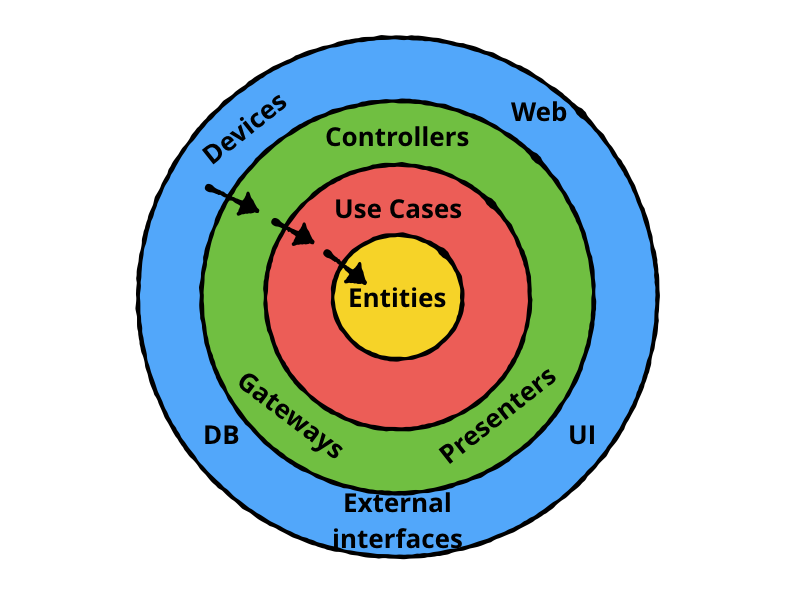

For quite a long time, there have been talks about writing an application in a clean way. Robert C. Martin, also known as Uncle Bob, has written a [book](https://www.amazon.com/Clean-Architecture-Craftsmans-Software-Structure/dp/0134494164), specifically on this topic.
Because the Clean architecture can be used in any application and platform, it’s very informative to understand the idea behind it, and why it’s a good solution, as programmers. 

## Clean Architecture

The main goal is to manage the complexity of the application. You might have seen this graph already:

A small brief about this is,

* The center circle is the most abstract, and the outer circle is the most concrete. This is called the **Abstraction Principle**. The Abstraction Principle specifies that inner circles should contain business logic, and outer circles should contain implementation details.
* Another principle of Clean Architecture is the **Dependency Rule**. This rule specifies that each circle can depend only on the nearest inward circle — this is what makes the architecture work.

The main benefit of using this architecture is to make the code to get decoupled, and easier to reuse and test.

### Layers of Clean Architecture

* **Presentation:** A layer that interacts with the UI, mainly Android Stuff like Activities, Fragments, ViewModel, etc. It would include both domain and data layers.
  * **ViewModel**
  If a user event is triggered in UI then we communicate it with ViewModel to take necessary action. Then ViewModel connects with the use case to get the result for the action.
* **Domain:** Contains the business logic of the app.
  * **UseCases**
  These are also known as interactors. Each individual functionality or business logic unit can be called a use case. Usecases are the business logic executors that fetch data from data source either remote or local and gives it back to the requester in our case it would be the app layer.
  * **Repository**
  The repository is an interface that we create in our domain module. And Repository Implementation will be in the data module. Here use cases acts as a mediator between our Repository interface and app module. The business logic unit are written in the repository. Like fetching data from a network or reading data from database, preferences, etc can be referred to as repository implementation.
* **Data:** Abstract definition of all the data sources.
  * **Mappers**
  Mappers by the name itself are suggesting that it maps from one type to another type. Actually, in our apps, we use the same object which we receive from the server to set details to UI. However, it would be a good practice to map the server model to the app model, where the app model contains only the data required to be consumed.

Below is the image of data flow we discussed.

The following frameworks are used in this application

* **Dagger/Hilt** - A fully static, compile-time dependency injection framework
* **RxJava 2** - is a library for asynchronous and event-based programs using observable sequences.
* **Retrofit 2** - A type-safe HTTP client for Android for Network calls
* **ViewMode**l - is a class that is responsible for preparing and managing the data for an Activity or a Fragment.
* **Kotlin** - Kotlin is a cross-platform, statically typed, general-purpose programming language with type inference

