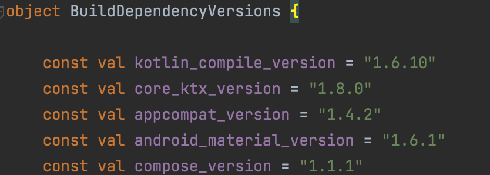
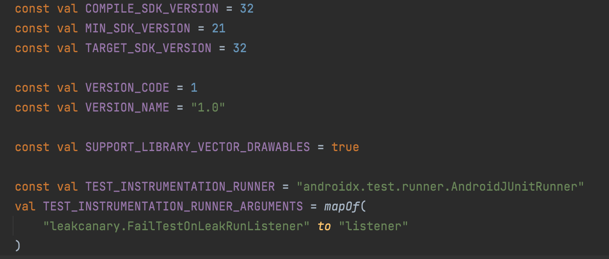
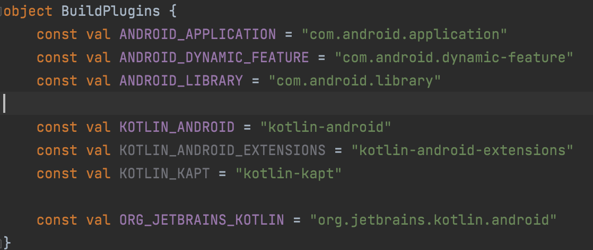
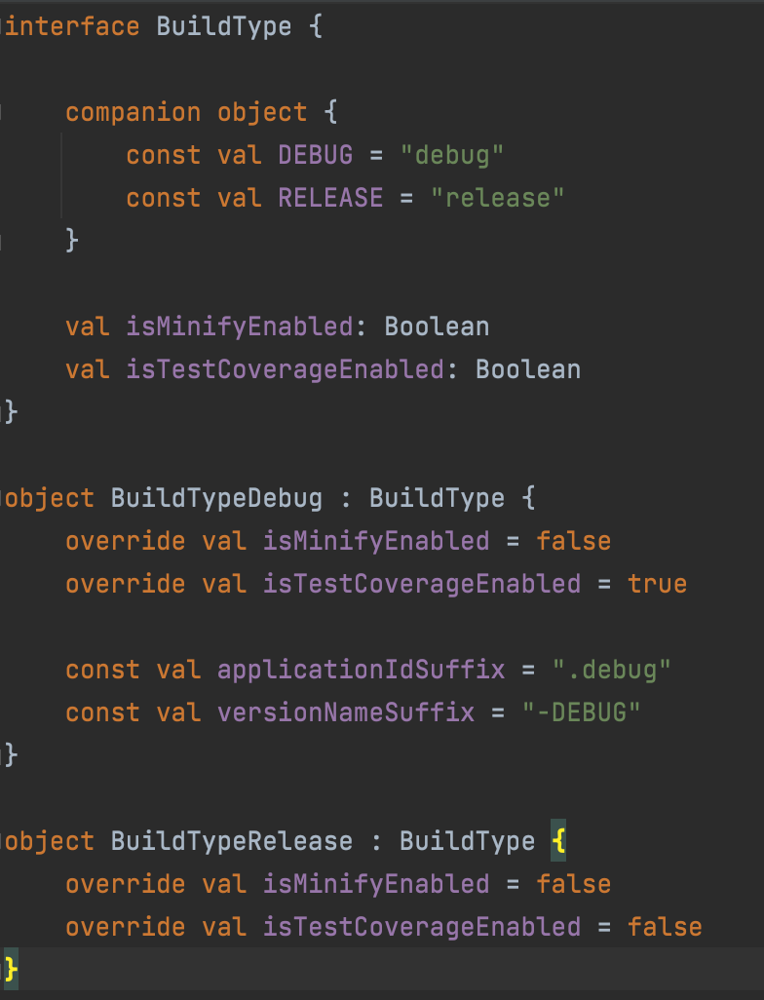
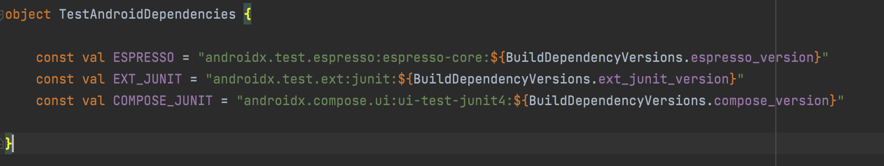
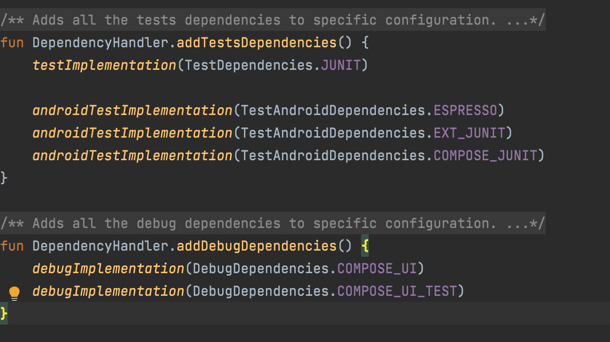

# Manage dependencies in a multi module project
With this approach we can able to use code completion support in all module of build.gradle file. We can define our dependencies using Kotlin or Java by the our project structure.

## Using Kotlin
We need to create buildSrc directory in the root directory of project and create build.gradle.kts in buildSrc directory. And then append kotlin-dsl plugin in build.gradle.kts.

```
plugins{
    `kotlin-dsl`
}
```

And create **src/main/kotlin** in **buildSrc** directory. Below mentioned the step by step guidelines 

* We will then create a file BuildDependencyVersions.kt and need to define required dependency versions to make that variables accessible through all modules.


* Created the BuildAndroidConfig.kt file which contains the android config details that needs to be specified in the app-level build.gradle.kts file


* Created the BuildModules.kt file to represent the name of the app, library and dynamic feature modules

* Created the BuildPlugins.kt file to represent the gradle plugins



* Created the BuildType.kt file to represent the build variants details. i.e. release, debug details


* Created the Dependencies.kt, DebugDependencies.kt, TestAndroidDependencies.kt, TestDependencies.kt files to mention the dependency libraries with its versions




* Created the DependencyHandler.kt file to handle for adding all the tests, debug dependencies to specific configuration.


As a last step reference dependency from Dependencies object

