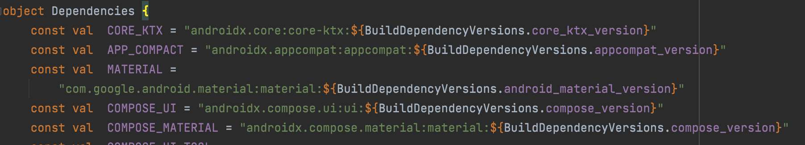

# Manage dependencies in a multi module project
With this approach we can able to use code completion support in all module of build.gradle file. We can define our dependencies using Kotlin or Java by the our project structure.

## Using Kotlin
We need to create buildSrc directory in the root directory of project and create build.gradle.kts in buildSrc directory. And then append kotlin-dsl plugin in build.gradle.kts.

```
plugins{
    `kotlin-dsl`
}
```
And create **src/main/kotlin** in **buildSrc** directory. We will then create a file Dependencies.kt and need to define required dependencies & it's versions to make that variables accessible through all modules.


As a last step reference dependency from Dependencies object

